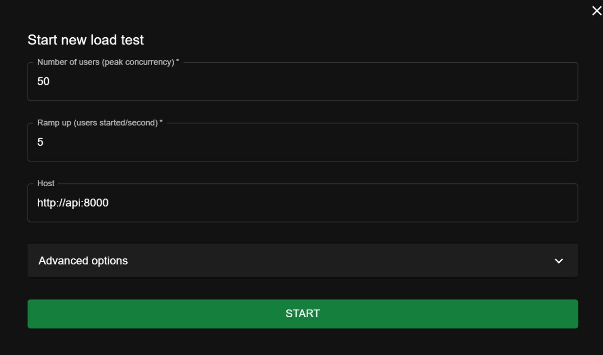
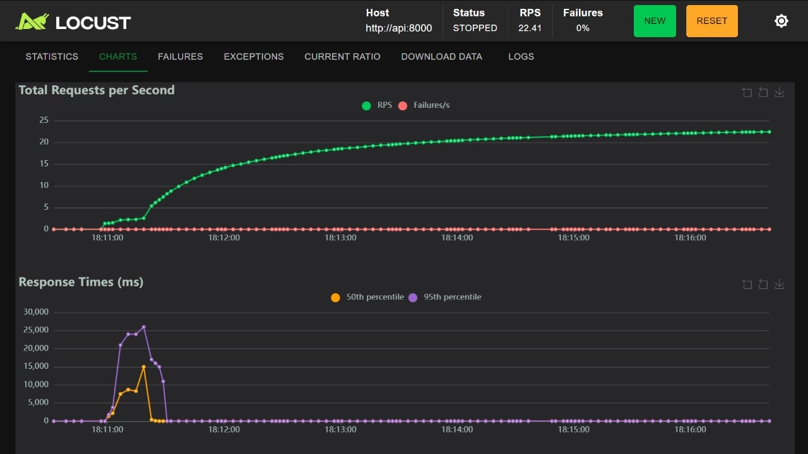
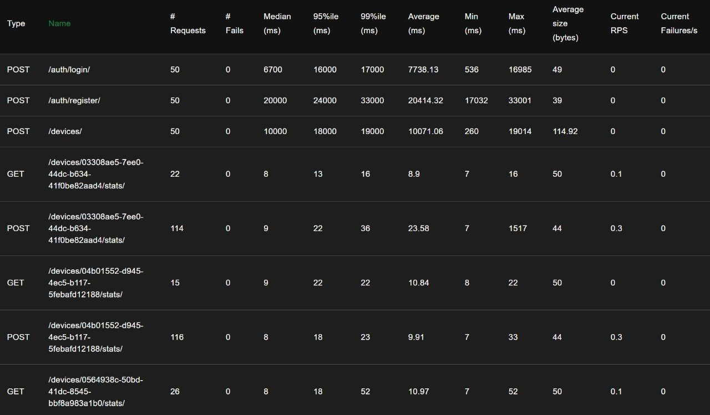
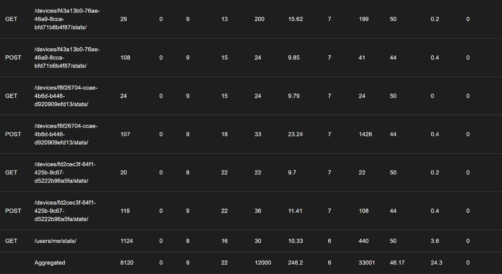

# Device Monitor API

REST API сервис для сбора и анализа показаний с устройств.

## Стек технологий

- **FastAPI** — веб-фреймворк
- **PostgreSQL** — основная база данных
- **SQLAlchemy + Asyncpg** — асинхронная работа с БД
- **Alembic** — миграции
- **Celery + Redis** — асинхронная обработка аналитики
- **Docker + Docker Compose** — контейнеризация
- **Locust** — нагрузочное тестирование

## Структура проекта

```
device_monitor/
├── app/
│   ├── auth/               # аутентификация и авторизация (JWT)
│   ├── users/              # пользователи
│   ├── devices/            # устройства
│   ├── measurements/       # показания устройств
│   ├── tasks/              # Celery таски
│   ├── dao/                # базовый DAO
│   ├── core/               # конфиг, исключения
│   ├── celery_app.py       # настройка Celery
│   └── main.py
├── locust/
│   └── locustfile.py
├── alembic/
├── docker-compose.yml
├── Dockerfile
├── .env.example
└── requirements.txt
```

## Запуск

### 1. Клонировать репозиторий

```bash
git clone https://github.com/username/device_monitor.git
cd device_monitor_api
```

### 2. Создать .env файл

```bash
cp .env.example .env
```

### 3. Запустить контейнеры

```bash
docker-compose up --build
```

### 4. Применить миграции

```bash
docker-compose exec api alembic upgrade head
```

Сервис доступен по адресу: `http://localhost:8000`

Документация Swagger: `http://localhost:8000/docs`

## Переменные окружения

```env
# PostgreSQL
DB_HOST=postgres
DB_PORT=5432
DB_NAME=device_monitor
DB_USER=postgres
DB_PASSWORD=postgres

# Redis
REDIS_HOST=redis
REDIS_PORT=6379

# JWT
SECRET_KEY=your_secret_key
ALGORITHM=HS256
```

## API Endpoints

### Auth

| Метод | Endpoint | Описание |
|-------|----------|----------|
| POST | `/auth/register/` | Регистрация пользователя |
| POST | `/auth/login/` | Авторизация |
| POST | `/auth/logout/` | Выход |
| GET | `/auth/me/` | Текущий пользователь |
| POST | `/auth/refresh/` | Обновление токенов |

### Devices

| Метод | Endpoint | Описание |
|-------|----------|----------|
| GET | `/devices/` | Список устройств пользователя |
| POST | `/devices/` | Добавить устройство |
| PUT | `/devices/{id}/` | Обновить устройство |
| DELETE | `/devices/{id}/` | Удалить устройство |

### Measurements

| Метод | Endpoint | Описание |
|-------|----------|----------|
| POST | `/devices/{id}/stats/` | Отправить показания `{x, y, z}` |
| GET | `/devices/{id}/stats/` | Получить аналитику по устройству |

Параметры для фильтрации по периоду:
```
GET /devices/{id}/stats/?from_dt=2024-01-01T00:00:00&to_dt=2024-01-31T23:59:59
```

### User Stats

| Метод | Endpoint | Описание |
|-------|----------|----------|
| GET | `/users/me/stats/` | Агрегированная аналитика по всем устройствам |
| GET | `/users/me/stats/each/` | Аналитика по каждому устройству отдельно |

### Формат ответа аналитики

```json
{
  "x": {"min": 1.2, "max": 5.6, "count": 100, "sum": 320.5, "median": 3.1},
  "y": {"min": 0.1, "max": 2.3, "count": 100, "sum": 150.2, "median": 1.1},
  "z": {"min": 4.0, "max": 9.9, "count": 100, "sum": 710.0, "median": 7.2}
}
```

## Нагрузочное тестирование

Запустить Locust:

```bash
docker-compose up locust
```

Открыть веб-интерфейс: `http://localhost:8089`

## Настройка и результаты тестирования






Тестирование при пиковой нагрузке 50 пользователей (ramp-up 5 users/sec) показало отличные результаты:
- RPS: 22.4
- Failures: 0%
- Время отклика: Стабильное по всем эндпоинтам (включая авторизацию и получение статистики), без критических скачков на графике Response Times.

## Мониторинг Celery задач

Flower — веб-интерфейс для мониторинга Celery воркеров и задач.

Доступен по адресу: `http://localhost:5555`
